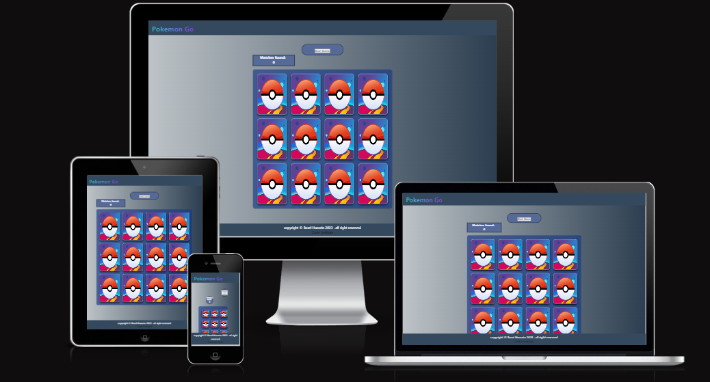
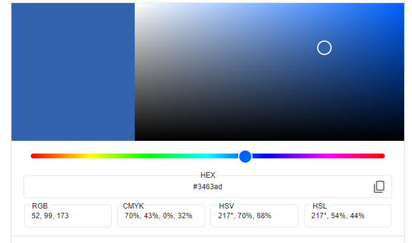
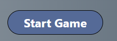
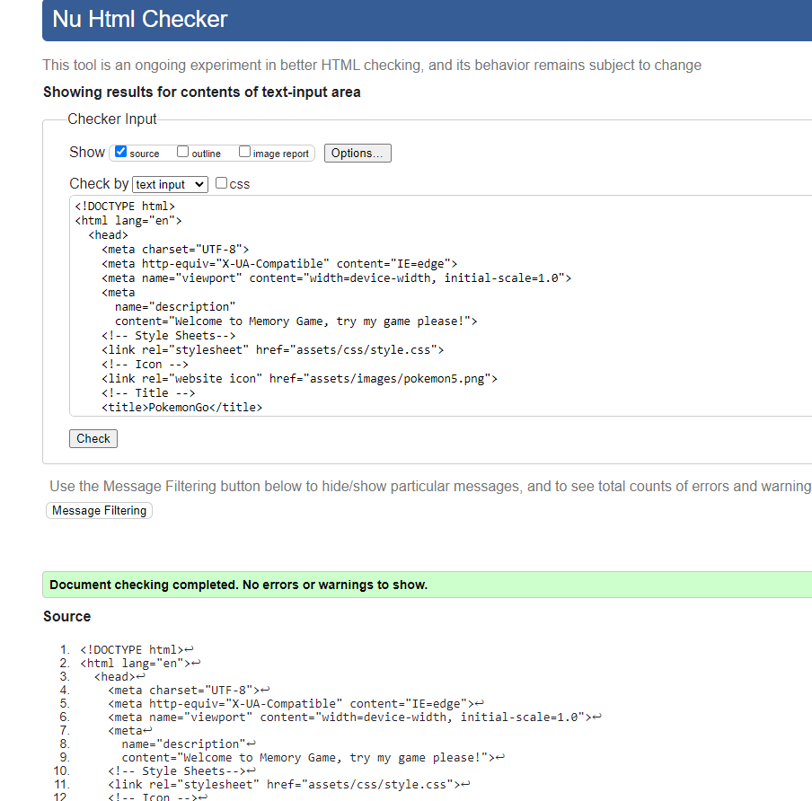
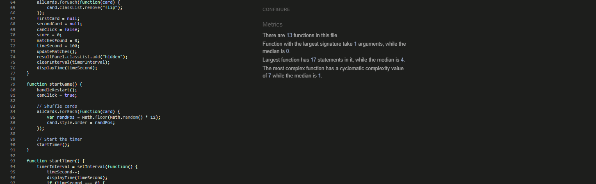
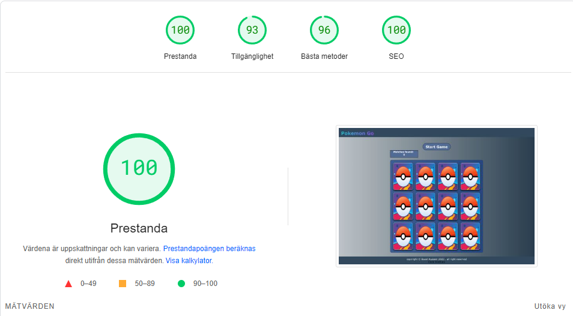
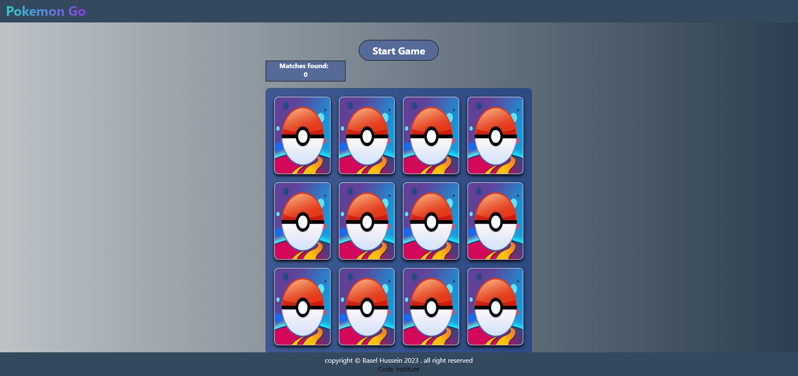
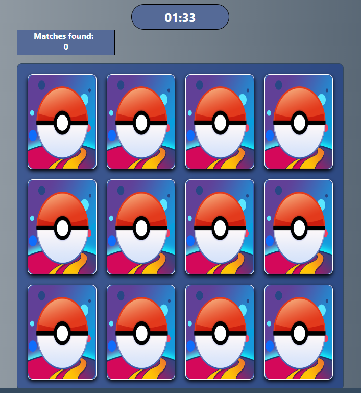
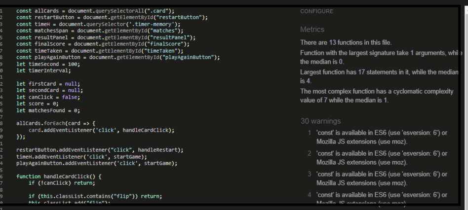

# Pokemon Go memory game

## Welcome to Pokemon Go memory game, help Pokemon reach his final form

In this exciting Pokémon Go Memory Game, embark on a journey to help Pokémon evolve! Uncover cards featuring various forms of Pokémon and match them to score points. Challenge your memory as you explore the enchanting world of Pokémon.

Game Instructions:

Score points by successfully matching pairs of Pokémon's different forms.
Win the game by successfully matching all the evolving Pokémon pairs.

Get ready for an immersive experience filled with fun and nostalgia! Dive into the Pokémon universe and test your memory skills. Have a blast on your quest to aid Pokémon in their evolution!

## [Live site](https://baselhn-cmd.github.io/PokemonGo/)

## Table Of Contents

- [Pokemon Go](#Pokemon-Go-memory-game)
  - [Table Of Contents](#table-of-contents)
  - [User Experience Design](#user-experience-design)
    - [User Demographic](#user-demographic)
    - [User Stories](#user-stories)
  - [Wireframes](#wireframes)
    - [Desktop](#desktop)
    - [Mobile](#mobile)
  - [Design](#design)
    - [Colours](#colours)
    - [Typography](#typography)
  - [Features](#features)
    - [Existing Features](#existing-features)
    - [Features Left to Implement](#Features-Left-to-Implement)
  - [Technologies Used](#technologies-used)
    - [Balsamiq](#balsamiq)
    - [HTML](#html)
    - [CSS](#css)
    - [JavaScript](#javascript)
    - [VS code](#vs-code)
    - [GitHub](#github)
  - [Testing](#testing)
    - [Validator Testing](#validator-testing)
      - [HTML Test](#html-test)
      - [CSS Test](#css-test)
      - [JavaScript Test](#javascript-test)
    - [Lighthouse Testing](#lighthouse-testing)
      - [Desktop Lighthouse Test](#desktop-lighthouse-test)
    - [Known Bugs](#known-bugs)
      - [Resolved](#resolved)
        - [HTML Warnings](#html-warnings)
      - [JavaScript Warnings and Bugs](#javascript-warnings-and-bugs)
      - [Unfixed Bugs](#unfixed-bugs)
  - [Deployment](#deployment)
  - [Credit](#credit)
    - [Content And Code](#content-and-code)

## User Experience Design

### User Demographic

This website is ment for:

- Users who Like to play games.
- Users who like to think.
- Users who have a good memory.

### User Stories

As a user of this website:

- Test my memory.
- Be able to start game with  button.
- See the timer on display.
- See if i the images identical.
- See my result after all cards flipped.
- Be able to restart the game after finish the game.

## Wireframes

### Desktop

.png)

.png)

.png)

### Other divice

.png)

## Design
I choose my own design

### Colours

I used Google to find and match the color

## Features

- **Start game button**

- When clicked starts the memory game.
- Match found box showing how many match finded.
- Lights up with a white color when hovered over.
- Changes to time when clicked.
- When countdown reaches zero it will say game over.
- If game is won it will say you win!

  
  

### Features Left to Implement

- When sountdown reaches zero it will show game over.
- Style Win screen modal.
- Add reset buttom.
- I would like to make animation on the modal and better design overall for the game.
- Better design for the website with more interactivity
  
## Technologies Used
### Balsamiq

- Used to design and choose what the page will look like before starting with the coding.

### HTML
- [HTML](https://en.wikipedia.org/wiki/HTML) Used for crafting the primary site content.

### CSS
- [CSS](https://en.wikipedia.org/wiki/CSS) Employed for designing and structuring the main site layout.
- [CSS Flexbox and CSS Grid](https://www.w3schools.com/css/css3_flexbox.asp) Utilized for creating a felxible and responsive layout.

### JavaScript
- [JavaScript](https://www.javascript.com) Implemented for enhancing user interaction and functionality on the site.

### GitHub

- [Git](<https://git-scm.com>) Employed for version control, including commands such as  (`git add`, `git commit`, `git push`).
- [GitHub](https://github.com) Utilized for secure online storage and management of the source code.

## Testing

### Validator Testing

#### HTML

No errors were returned when passing through the [W3C Markup validator](https://validator.w3.org/).

#### CSS

No errors were found when passing through the [W3C CSS Validator](https://jigsaw.w3.org/css-validator/)

#### JavaScript
No errors were found

 [JavaScript validator](https://jshint.com/)

 

### Lighthouse testing

Lighthouse was a helpful tool for checking where where the website was experiencing the most issues.

## Manual Testing

- All links on every page have been thoroughly checked,and the form was succefuly submitted to cpnfirmation page.

- Pokemon Go memory game

- When the user press start Game the timer start shutting down

- Start matchthe same pictures

.png)

- Match all the pictures and you win

.png)

### Known Bugs

#### Resolved

During code validation, these warnings were shown:

#### Unfixed Bugs

#### JavaScript Warnings and Bugs
- During code validation, these warnings were shown:

The error message indicates that you I´m using a version of JavaScript that doesn't support the const keyword, which was introduced in ECMAScript 6 (ES6). 

- I resolve this issue by changing const to var to support ES6 or modify your JavaScript .

## Deployment

The website was deployed to GitHub pages. Here is how you deploy on GitHub:

1. In the GitHub repository, click on the setting tab.
2. On the left side under the code and automation section, click on pages.
3. Set branch as main and click save.
4. The website will deploy after a few minutes. The link will be seen at the top of the page.

A live version of the website and the project can be accessed here:
[Pokemon Go](https://baselhn-cmd.github.io/PokemonGo/)

## Credit

### Content And Code

- The icons used on the social media were taken from [Font Awesome.](https://fontawesome.com)
- To generate my favicon image, I did it on [Favicon.](https://favicon.io/)
- The screenshot at the top of the ReadMe was built from [Ami Responsive.](https://ui.dev/amiresponsive)
- The wireframes for the ReadMe were made by [Balsamiq.](https://balsamiq.com/)

- #### Inspiration and tutorials used from

  - [W3Schools](https://www.w3schools.com/)
  - [Mdn Web Docs](<https://developer.mozilla.org/en-US/>)
  - [Stack overflow](https://stackoverflow.com/)
  - Code Institute Slack Channel
  - Special thanks to  my mentor Dick Vlaanderen and Mo Shami.

  [Back to top](#Pokemon-Go-memory-game)
