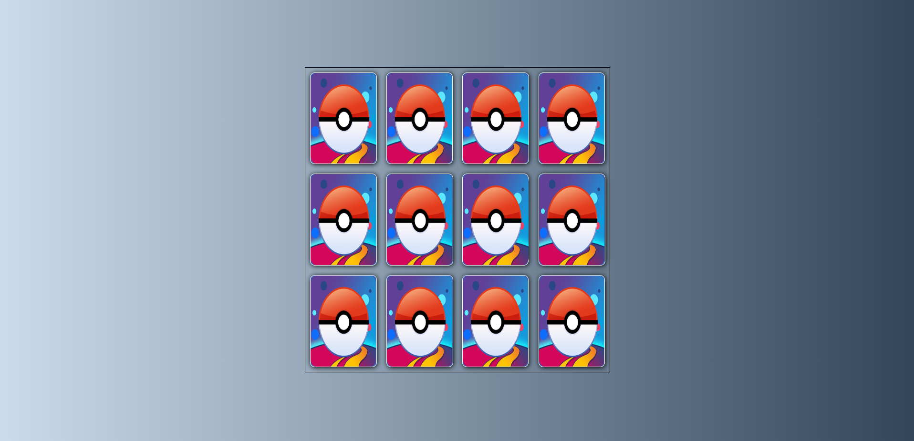

#Pokemon memory game
Welcome to Pokemon go memory game
In this game you will catch pokemon cards

## UX
I choose This coolors

### Features Left to Implement

- Add header with logo.
- Add Start and reset buttom.

## Testing

### Validator Testing

#### HTML

No errors were returned when passing through the [W3C Markup validator](https://validator.w3.org/).

#### CSS

No errors were found when passing through the [W3C CSS Validator](https://jigsaw.w3.org/css-validator/) validator

## Manual Testing

-All links on every page have been thoroughly checked,and the form was succefuly submitted to cpnfirmation page.

## Credits

### Content

- Idea and text by myself
- Photo from Google

- #### Inspiration and tutorials used from

  - [W3Schools](https://www.w3schools.com/)
  - [Mdn Web Docs](<https://developer.mozilla.org/en-US/>)
  - [Stack overflow](https://stackoverflow.com/)
  - Code Institute Slack Channel
- Special thanks to  mentor @Dick Vlaanderen.
